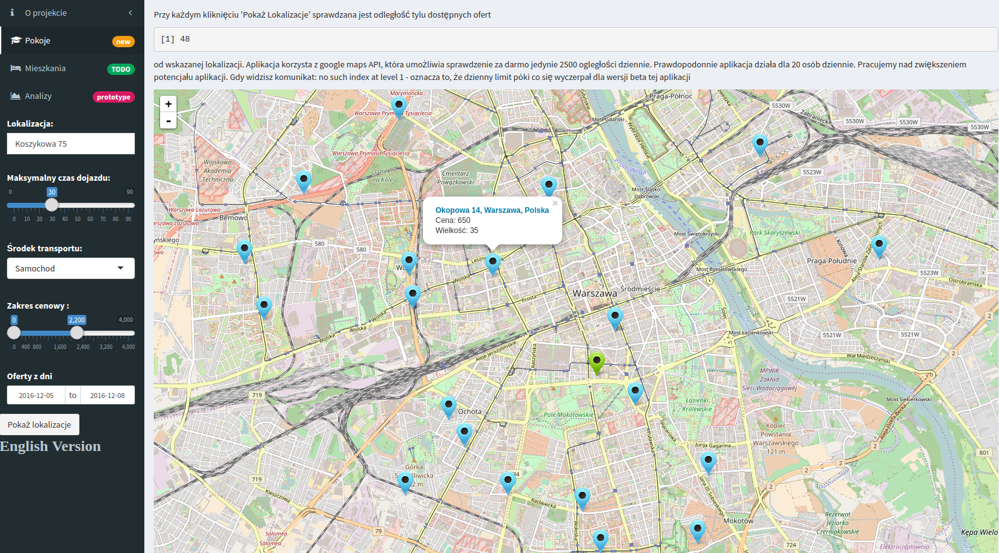
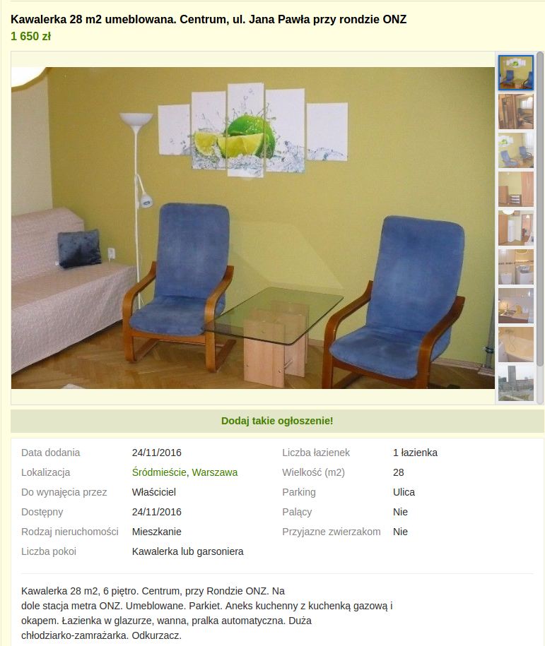
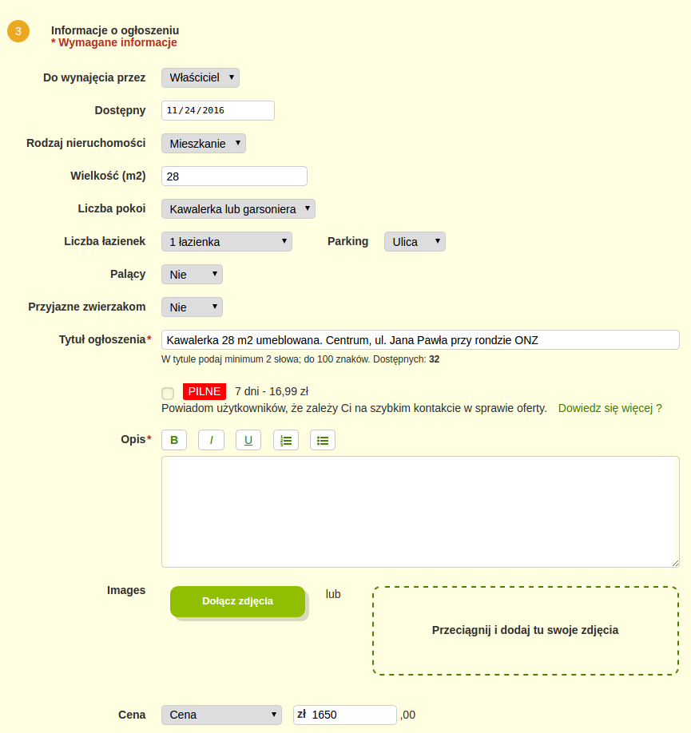

```{r setup, include = FALSE}
library(knitr)
library(pander)
opts_chunk$set(
    comment = "",
    fig.width = 12,
    echo = FALSE,
    eval = TRUE,
    message = FALSE,
    warning = FALSE,
    tidy.opts = list(
        keep.blank.line = TRUE,
        width.cutoff = 150
        ),
    options(width = 150)
)
```

```{r}
library(dplyr)
library(ggplot2)
library(readr)
library(stringi)
library(htmltools)
```

## Inspiracja

- Praktyczny wymiar projektu
- Aplikacja bazująca na modelu przewidującym ceny



## Struktura danych




## Jedna zmienna objaśniająca

<center>Przed - <font color="#00FFFF"><b>13</b></font> tysięcy ofert, po - <font color="#FFFF00"><b>10</b></font> tysięcy<center>
<hr style="visibility:hidden;">

```{r}
dane <- read_csv("dane.csv")
dane <-
  dane %>%
  mutate(
    lokalizacja = lokalizacja %>%
      stri_replace_first_regex(", Warszawa", "") %>%
      as.factor(),
    do_wynajecia_przez = do_wynajecia_przez %>% as.factor(),
    parking = parking %>% as.factor(),
    liczba_pokoi = liczba_pokoi %>% as.factor(),
    rodzaj_nieruchomosci = rodzaj_nieruchomosci %>% as.factor(),
    liczba_lazienek = liczba_lazienek %>% as.factor(),
    palacy = palacy %>% as.factor(),
    przyjazne_zwierzakom = przyjazne_zwierzakom %>% as.factor()
  )

ggplot(
  dane,
  aes(wielkosc, cena)
) +
  geom_point(position = position_jitter(2, 100), alpha = 0.25) +
  geom_smooth(aes(color = "1"), method = "lm") +
  geom_smooth(aes(color = "2"), method = "lm", formula = y ~ poly(x, 2)) +
  geom_smooth(aes(color = "6"), method = "lm", formula = y ~ poly(x, 6)) +
  scale_x_continuous(
    expression("wielkość [m"^{2}*"]"),
    breaks = seq(0, 100, 10)
  ) +
  scale_y_continuous(
    "cena [PLN]",
    breaks = seq(0, 5000, 500)
  ) +
  scale_colour_manual(
    name = "Stopień wielomianu",
    values = c("1" = "red", "2" = "green", "6" = "blue")
  ) +
  ggtitle("Zależność ceny od metrażu") +
  theme(
    plot.title = element_text(face = "bold"),
    legend.background = element_blank(),
    legend.title = element_text(face = "bold"),
    legend.text = element_text(face = "bold"),
    legend.position = c(0.1, 0.9)
  )
```

## Wiele zmiennych objaśniających

<center>Przed - <font color="#FF0000"><b>39</b></font> zmiennych niezależnych, po - <font color="#00FF00"><b>26</b></font></center>
<hr style="visibility:hidden;">

```{r}
library(leaps)

nPred <-
  function(dane) {
    dane %>%
      sapply(
        function(x) {
          x %>%
            levels() %>%
            length() %>%
            plyr::mapvalues(0, 2, warn_missing = FALSE)-1
        }
      ) %>%
      sum()-1
  }

npDane <- nPred(dane)
fit41 <- regsubsets(cena~., dane, nvmax = npDane)
fit42 <- regsubsets(cena~., dane, nvmax = npDane, method = "forward")
fit43 <- regsubsets(cena~., dane, nvmax = npDane, method = "backward")

set.seed(44)
trening44 <- sample(1:nrow(dane), 9000)
invisible(
  capture.output(
    fit44 <-
      regsubsets(
        cena ~ .,
        dane[trening44,],
        nvmax = nPred(dane[trening44,]),
        method = "forward"
      )
  )
)
test44 <- model.matrix(cena~., dane[-trening44, ])
valBlad <-
  1:(fit44$nvmax-1) %>%
  sapply(
    function(x) {
      coefi <- coef(fit44, id = x)
      pred <- test44[, names(coefi)]%*%coefi
      mean((dane$cena[-trening44]-pred)^2)
    }
  )

predict.regsubsets <-
  function(obiekt, dane, id, ...) {
    form <- as.formula(obiekt$call[[2]])
    mat <- model.matrix(form, dane)
    coefi <- coef(obiekt, id = id)
    mat[, names(coefi)]%*%coefi
  }

K <- 10
set.seed(45)
folds <- sample(rep(1:K, length = nrow(dane)))
cvBledy <- matrix(NA, K, npDane)
for (k in 1:K) {
  invisible(
    capture.output(
      best.fit <-
        regsubsets(
          cena~.,
          dane[folds!=k, ],
          nvmax = nPred(dane[folds!=k, ]),
          method = "forward"
        )
    )
  )
  for (i in 1:(fit44$nvmax-1)) {
    pred <- predict.regsubsets(best.fit, dane[folds==k, ], id = i)
    cvBledy[k, i] <- mean((dane$cena[folds==k]-pred)^2)
  }
}
rmse.cv <- sqrt(apply(cvBledy, 2, mean))
```

```{r}
library(glmnet)

x <- model.matrix(cena~.-1, dane)
y <- dane$cena

fit45 <- glmnet(x, y, alpha = 0)
cvRidge <- cv.glmnet(x, y, alpha = 0)

daneNorm <-
  dane %>%
  mutate(
    cena = (cena-mean(cena))/max(cena),
    wielkosc = (wielkosc-mean(wielkosc))/max(wielkosc),
    liczba_wyrazow = (liczba_wyrazow-mean(liczba_wyrazow))/max(liczba_wyrazow)
  )

xn <- model.matrix(cena~.-1, daneNorm)
yn <- daneNorm$cena

fit45N <- glmnet(xn, yn, alpha = 0)

cvRidgeN <- cv.glmnet(xn, yn, alpha = 0)
```

```{r}
fit46 <- glmnet(x, y)
cvLasso <- cv.glmnet(x, y)

fit47 <- glmnet(xn, yn)
cvLassoN <- cv.glmnet(xn, yn)

lasso.tr <- glmnet(x[trening44, ], y[trening44])
pred <- predict(lasso.tr, x[-trening44, ])
rmse <- sqrt(apply((y[-trening44]-pred)^2, 2, mean))

lam.best <- lasso.tr$lambda[order(rmse)[1]]
```

```{r}
p <- npDane
n <- 100

rozmiary <-
  data_frame(
    Metoda = c(
        "Best Subset Regression",
        "Forward Stepwise Selection",
        "Backward Stepwise Selection",
        "Walidacja",
        "Kroswalidacja",
        "Ridge Regression",
        "Lasso"
      ),
    `Liczba modeli` = c(
        HTML("2<sup><small>p</small></sup>"),
        HTML("<sup>p<sup><small>2</small></sup></sup>&frasl;<sub>2</sub>"),
        HTML("<sup>p<sup><small>2</small></sup></sup>&frasl;<sub>2</sub>"),
        HTML("<sup>p<sup><small>2</small></sup></sup>&frasl;<sub>2</sub>"),
        HTML("K <sup>p<sup><small>2</small></sup></sup>&frasl;<sub>2</sub>"),
        HTML("K n<sub>&lambda;</sub>"),
        HTML("K n<sub>&lambda;</sub>")
      ),
    `p=30 K=10 n=100` = c(
      HTML("10<sup><small>12</small></sup>"),
      round((p^2)/2),
      round((p^2)/2),
      round((p^2)/2),
      round(K*(p^2)/2),
      K*n,
      K*n
    ),
    `Najmniejszy błąd` = c(
      (fit41$rss/nrow(dane)) %>% min() %>% sqrt() %>% round(),
      (fit42$rss/nrow(dane)) %>% min() %>% sqrt() %>% round(),
      (fit43$rss/nrow(dane)) %>% min() %>% sqrt() %>% round(),
      valBlad %>% min() %>% sqrt() %>% round(),
      rmse.cv %>% na.omit() %>% min() %>% round(),
      cvRidge$cvm %>% min() %>% sqrt() %>% round(),
      cvLasso$cvm %>% min() %>% sqrt() %>% round()
    )
  )

rozmiary %>% kable(align = "c")
# pander(rozmiary %>% pandoc.table(split.tables = Inf))
```

## Napotkane problemy

- Wyrafinowana analiza treści opisu
- Propozycja dokładnego opisu atrybutów w formularzu na [gumtree.pl](gumtree.pl)

```{r}
pokoje <- read_csv("pokoje.csv")

pokoje <-
  pokoje %>%
  mutate(
    lokalizacja = lokalizacja %>%
      stri_replace_first_regex(", Warszawa", "") %>%
      as.factor(),
    do_wynajecia_przez = do_wynajecia_przez %>% as.factor(),
    wspoldzielenie = wspoldzielenie %>% as.factor(),
    liczba_pokoi = liczba_pokoi %>% as.factor(),
    rodzaj_nieruchomosci = rodzaj_nieruchomosci %>% as.factor(),
    preferowana_plec = preferowana_plec %>% as.factor(),
    palacy = palacy %>% as.factor(),
    przyjazne_zwierzakom = przyjazne_zwierzakom %>% as.factor()
  )

sprawdzenie01 <-
  pokoje %>%
  filter(
    between(cena, 50, 1500),
    between(wielkosc, 10, 100)
  )

ggplot(
  sprawdzenie01,
  aes(wielkosc, cena)
) +
  geom_point(position = position_jitter(2, 100), alpha = 0.25) +
  geom_smooth(method = "lm", color = "red") +
  scale_x_continuous(
    expression("wielkość [m"^{2}*"]"),
    breaks = seq(0, 100, 10)
  ) +
  scale_y_continuous(
    "cena [PLN]",
    breaks = seq(0, 1500, 100)
  ) +
  ggtitle("Zależność ceny od metrażu") +
  theme(plot.title = element_text(face = "bold"))
```

## Przygotowanie do projektu

Ukończenie kursów:

- Machine Learning at Coursera by Andrew Ng (18 godzin)
- Statistical Learning at Stanford ONLINE by Trevor Hastie and Robert Tibshirani (15 godzin)

Zapoznanie się z narzędziami:

- Hadoop HDFS
- Spark (pakiet [sparklyr](http://spark.rstudio.com/))
- Pakiety do różnego rodzaju regresji ([boot](http://cran.r-project.org/web/packages/boot/index.html), [leaps](http://cran.r-project.org/web/packages/leaps/index.html), [glmnet](http://web.stanford.edu/~hastie/glmnet/glmnet_alpha.html))
- Pakiety do tworzenia prezentacji [revealjs](http://cran.r-project.org/web/packages/revealjs/index.html)

## Kod i inne projekty

- Kod napisany na potrzeby tego projektu na [github](http://github.com/krzyslom/tuatara)
- [Raport](http://mi2.mini.pw.edu.pl:3838/pracuj/ml) z innego projektu w którym brałem udział